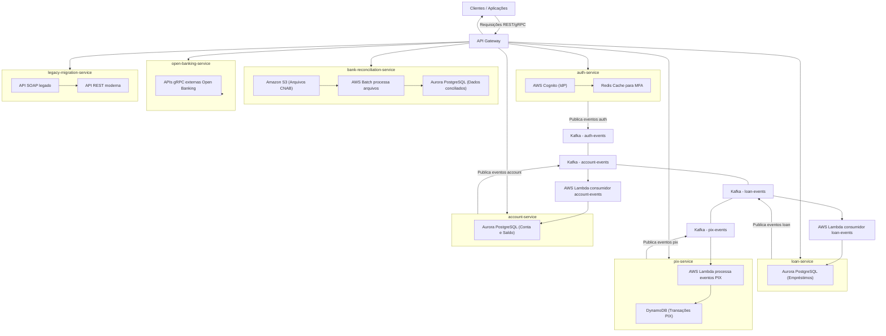

# Documentação Técnica e Arquitetural Completa — FinBank Backend

## 1. Arquitetura Geral

## Premissas para cada serviço:

* **API Gateway** recebe as requisições síncronas dos clientes e repassa para o microsserviço correspondente.
* O microsserviço valida, aplica regras de negócio e dependendo do caso:

  * Pode retornar resposta direta (ex: consulta saldo)
  * Pode publicar eventos no Kafka para processamento assíncrono (ex: transação PIX)
* Serviços consumidores (ex: Lambdas) processam os eventos Kafka, atualizam banco, disparam outras ações.
* Bancos (Aurora, DynamoDB) armazenam estado e dados finais.
* Serviços de autenticação (Cognito + Redis) gerenciam login, MFA etc.
* Serviços batch (AWS Batch + S3) processam arquivos (ex: CNAB).
* Open Banking se comunica via APIs gRPC externas.

---

### 1.1 Diagrama Macro (Mermaid)

---

# Explicações detalhadas por serviço:

### 1. auth-service

* Cliente chama API Gateway `/login` ou `/signup`.
* `auth-service` autentica via Cognito.
* MFA é armazenado e validado no Redis.
* Publica eventos como `UserLoggedIn` no Kafka.
* Responde o cliente com token JWT.

### 2. account-service

* Recebe requisições de criação, consulta saldo, extrato.
* Atualiza estado em Aurora.
* Publica eventos de movimentação no Kafka.
* Lambdas consumidores processam eventos, garantem consistência.

### 3. loan-service

* Gerencia empréstimos, simulações.
* Atualiza Aurora.
* Eventos são consumidos e geram histórico, notificações.

### 4. pix-service

* Cliente solicita PIX via API Gateway.
* `pix-service` valida e publica evento `PixRequested` no Kafka.
* Lambda consome, executa transação no DynamoDB.
* Consulta de status é síncrona via API Gateway e DynamoDB.

### 5. bank-reconciliation-service

* Processa arquivos CNAB enviados para S3.
* Batch processa, atualiza Aurora com dados conciliados.
* Disponibiliza relatórios.

### 6. open-banking-service

* Comunicação via gRPC com APIs externas.
* Expõe APIs para consulta de dados financeiros.

### 7. legacy-migration-service

* Middleware SOAP → REST para sistemas antigos.
* Permite migração gradual.

---

## 2. Microsserviços e Modelagem DDD

### 2.1 auth-service

#### Entidades (Domain Layer)

| Campo      | Tipo      | Descrição                      |
| ---------- | --------- | ------------------------------ |
| id         | UUID      | Identificador único do usuário |
| email      | string    | Email do usuário               |
| senhaHash  | string    | Hash da senha                  |
| mfaEnabled | boolean   | Indica se MFA está habilitado  |
| roles      | string\[] | Papéis do usuário              |

#### Casos de Uso

| Caso de Uso       | Entrada                      | Saída                   | Eventos Disparados       |
| ----------------- | ---------------------------- | ----------------------- | ------------------------ |
| Registrar Usuário | email, senha, dados pessoais | Confirmação de cadastro | `UserRegistered`         |
| Login com MFA     | email, senha, código MFA     | JWT + dados do usuário  | `UserLoggedIn`           |
| Resetar Senha     | email                        | Confirmação de reset    | `PasswordResetRequested` |

#### API

| Método | Rota            | Descrição                | Autenticação |
| ------ | --------------- | ------------------------ | ------------ |
| POST   | /register       | Registrar novo usuário   | Não          |
| POST   | /login          | Autenticar usuário       | Não          |
| POST   | /reset-password | Solicitar reset de senha | Não          |

---

### 2.2 account-service

#### Entidades (Domain Layer)

| Campo     | Tipo   | Descrição                          |
| --------- | ------ | ---------------------------------- |
| id        | UUID   | Identificador da conta             |
| userId    | UUID   | Dono da conta                      |
| saldo     | number | Saldo atual da conta               |
| tipoConta | string | Tipo da conta (corrente, poupança) |
| status    | string | Ativa, bloqueada, etc              |

| Transação      |        |                                |
| -------------- | ------ | ------------------------------ |
| id             | UUID   | Identificador da transação     |
| contaOrigemId  | UUID   | Conta debitada                 |
| contaDestinoId | UUID   | Conta creditada (opcional)     |
| valor          | number | Valor da transação             |
| tipo           | string | Depósito, saque, transferência |
| data           | Date   | Data da transação              |

#### Casos de Uso

| Caso de Uso           | Entrada                              | Saída                        | Eventos Disparados  |
| --------------------- | ------------------------------------ | ---------------------------- | ------------------- |
| Criar Conta           | userId, tipoConta                    | Detalhes da conta criada     | `AccountCreated`    |
| Depositar             | contaId, valor                       | Confirmação do depósito      | `DepositMade`       |
| Sacar                 | contaId, valor                       | Confirmação do saque         | `WithdrawalMade`    |
| Transferência Interna | contaOrigemId, contaDestinoId, valor | Confirmação da transferência | `TransferCompleted` |

#### API

| Método | Rota               | Descrição                  | Autenticação |
| ------ | ------------------ | -------------------------- | ------------ |
| POST   | /accounts          | Criar nova conta           | Sim          |
| POST   | /accounts/deposit  | Depositar valor na conta   | Sim          |
| POST   | /accounts/withdraw | Sacar valor da conta       | Sim          |
| POST   | /accounts/transfer | Transferência entre contas | Sim          |

---

### 2.3 loan-service

#### Entidades (Domain Layer)

| Campo      | Tipo   | Descrição                                     |
| ---------- | ------ | --------------------------------------------- |
| id         | UUID   | Identificador do empréstimo                   |
| contaId    | UUID   | Conta associada                               |
| valor      | number | Valor solicitado                              |
| parcelas   | number | Número de parcelas                            |
| taxaJuros  | number | Taxa de juros aplicada                        |
| status     | string | Status (solicitado, aprovado, pago, atrasado) |
| dataInicio | Date   | Data de início do contrato                    |

| Parcela        |         |                             |
| -------------- | ------- | --------------------------- |
| id             | UUID    | Identificador da parcela    |
| emprestimoId   | UUID    | Empréstimo associado        |
| valor          | number  | Valor da parcela            |
| dataVencimento | Date    | Vencimento da parcela       |
| pago           | boolean | Indica se parcela está paga |

#### Casos de Uso

| Caso de Uso          | Entrada                             | Saída                    | Eventos Disparados  |
| -------------------- | ----------------------------------- | ------------------------ | ------------------- |
| Solicitar Empréstimo | contaId, valor, parcelas, taxaJuros | Confirmação do pedido    | `LoanRequested`     |
| Aprovar Empréstimo   | emprestimoId                        | Confirmação de aprovação | `LoanApproved`      |
| Registrar Pagamento  | parcelaId                           | Confirmação de pagamento | `PaymentRegistered` |

#### API

| Método | Rota                | Descrição                      | Autenticação |
| ------ | ------------------- | ------------------------------ | ------------ |
| POST   | /loans              | Solicitar empréstimo           | Sim          |
| POST   | /loans/{id}/approve | Aprovar empréstimo             | Sim          |
| POST   | /loans/{id}/payment | Registrar pagamento de parcela | Sim          |

---

### 2.4 pix-service

#### Entidades (Domain Layer)

| Campo          | Tipo   | Descrição                           |
| -------------- | ------ | ----------------------------------- |
| id             | UUID   | Identificador da transação PIX      |
| contaOrigemId  | UUID   | Conta que envia o PIX               |
| contaDestinoId | UUID   | Conta que recebe o PIX              |
| valor          | number | Valor da transação                  |
| status         | string | Status (pendente, concluído, falha) |
| dataCriacao    | Date   | Data da criação da transação        |

#### Casos de Uso

| Caso de Uso | Entrada                              | Saída                              | Eventos Disparados |
| ----------- | ------------------------------------ | ---------------------------------- | ------------------ |
| Enviar PIX  | contaOrigemId, contaDestinoId, valor | Confirmação da transação           | `PixSent`          |
| Receber PIX | idTransacao, status                  | Atualização do status da transação | `PixReceived`      |

#### APIs

| Método | Rota             | Descrição               | Autenticação |
| ------ | ---------------- | ----------------------- | ------------ |
| POST   | /pix/send        | Enviar transação PIX    | Sim          |
| GET    | /pix/status/{id} | Consultar status de PIX | Sim          |

---

### 2.5 bank-reconciliation-service

#### Função Principal

* Processar arquivos CNAB armazenados no S3
* Realizar conciliação automática via AWS Batch
* Atualizar saldos e status no Aurora
* Notificar inconsistências via alertas

#### Casos de Uso

| Caso de Uso            | Entrada            | Saída                    | Eventos Disparados        |
| ---------------------- | ------------------ | ------------------------ | ------------------------- |
| Processar arquivo CNAB | Arquivo CNAB no S3 | Resultado da conciliação | `ReconciliationCompleted` |

---

### 2.6 open-banking-service

#### Função Principal

* Consumo de APIs externas do Open Banking (gRPC e REST)
* Tradução de dados para formato interno
* Autenticação via OAuth2

---

### 2.7 legacy-migration-service

#### Função Principal

* Adaptar APIs SOAP legadas para REST modernas
* Facilitar migração gradual de sistemas legados

---

## 3. Fluxos e Protocolos

* **Kafka Topics**: `auth-events`, `account-events`, `loan-events`, `pix-events`
* **Eventos JSON** com padrão definido (eventType, timestamp, payload)
* **Streams DynamoDB + Lambda** para PIX
* **Integração Cognito + Redis para Auth**

---
