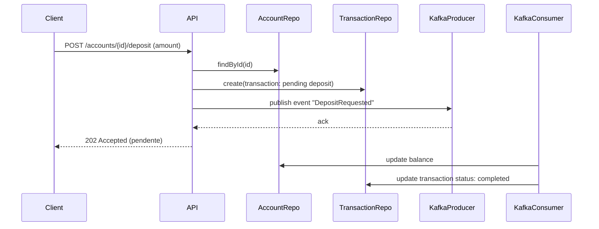
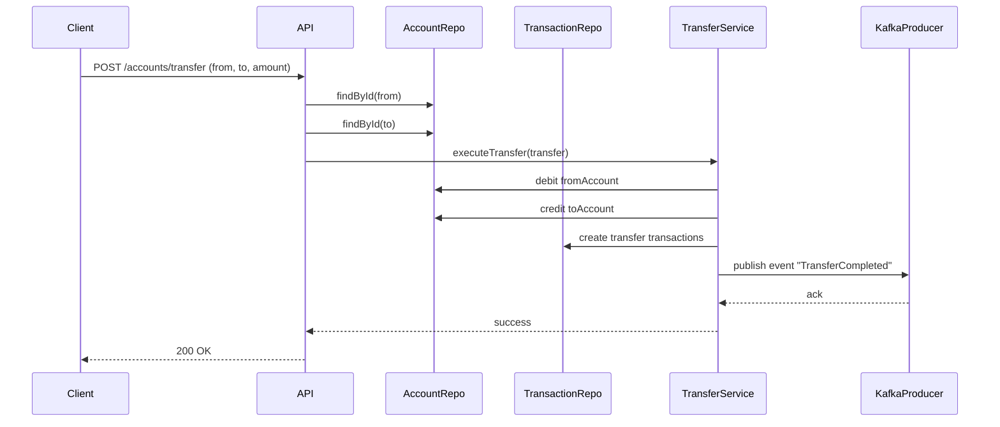

# account-service - Documentação Técnica Completa

---

## 1. Diagrama de Classes (DDD)

### 1.1 Entidades

* **Account**

  * id: UUID
  * userId: UUID (dono da conta)
  * accountNumber: string (número único da conta)
  * accountType: enum (corrente, poupança, etc)
  * balance: decimal (saldo atual)
  * status: enum (ativa, bloqueada, encerrada)
  * createdAt: Date
  * updatedAt: Date

* **Transaction**

  * id: UUID
  * accountId: UUID
  * type: enum (deposit, withdraw, transfer)
  * amount: decimal
  * status: enum (pending, completed, failed)
  * referenceId: string (ex: id da transferência ou pagamento)
  * createdAt: Date
  * updatedAt: Date

* **Transfer** (Value Object)

  * fromAccountId: UUID
  * toAccountId: UUID
  * amount: decimal
  * status: enum (pending, completed, failed)
  * transactionId: UUID
  * createdAt: Date

### 1.2 Interfaces (Ports)

* **IAccountRepository**

  * findById(id: UUID): Promise\<Account | null>
  * findByUserId(userId: UUID): Promise\<Account\[]>
  * create(account: Account): Promise<Account>
  * update(account: Account): Promise<void>

* **ITransactionRepository**

  * create(transaction: Transaction): Promise<Transaction>
  * findByAccountId(accountId: UUID): Promise\<Transaction\[]>

* **ITransferService**

  * executeTransfer(transfer: Transfer): Promise<void>

---

## 2. Diagrama de Sequência

### 2.1 Fluxo de Depósito

### 2.2 Fluxo de Transferência

---

## 3. Mapa de Eventos Kafka

| Evento              | Tópico Kafka           | Descrição                           | Consumidores                        |
| ------------------- | ---------------------- | ----------------------------------- | ----------------------------------- |
| DepositRequested    | `deposit-requested`    | Pedido de depósito iniciado         | pix-service, audit-service          |
| DepositCompleted    | `deposit-completed`    | Depósito confirmado                 | notification-service, audit-service |
| WithdrawalRequested | `withdrawal-requested` | Pedido de saque iniciado            | audit-service                       |
| WithdrawalCompleted | `withdrawal-completed` | Saque confirmado                    | notification-service, audit-service |
| TransferCompleted   | `transfer-completed`   | Transferência concluída com sucesso | audit-service, notification-service |

---

## 4. Observações importantes

* Saldo **deve ser atualizado de forma atômica** para evitar condições de corrida.
* Transações financeiras seguem o princípio de consistência eventual com eventos Kafka.
* Validar saldo antes de realizar saques ou transferências.
* Registrar todos eventos relevantes para auditoria.
* API deve expor endpoints REST seguros e com autenticação JWT.
