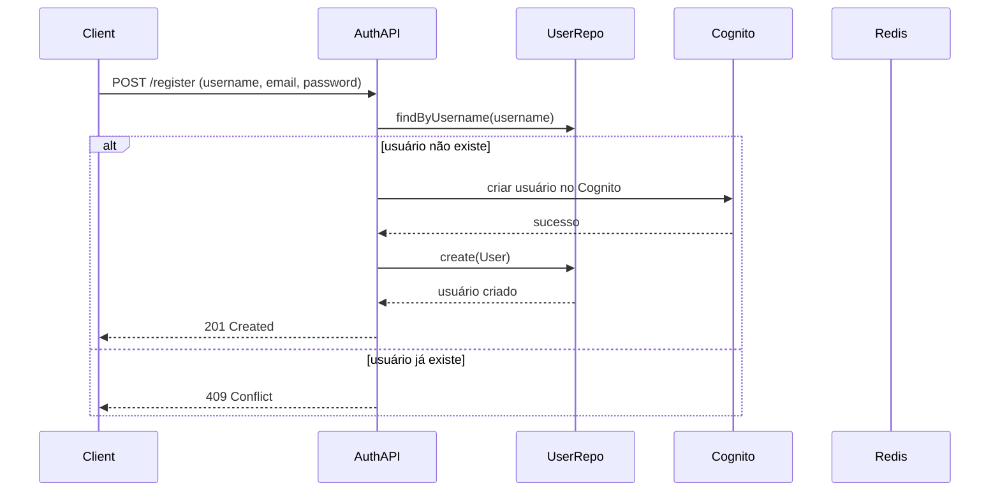
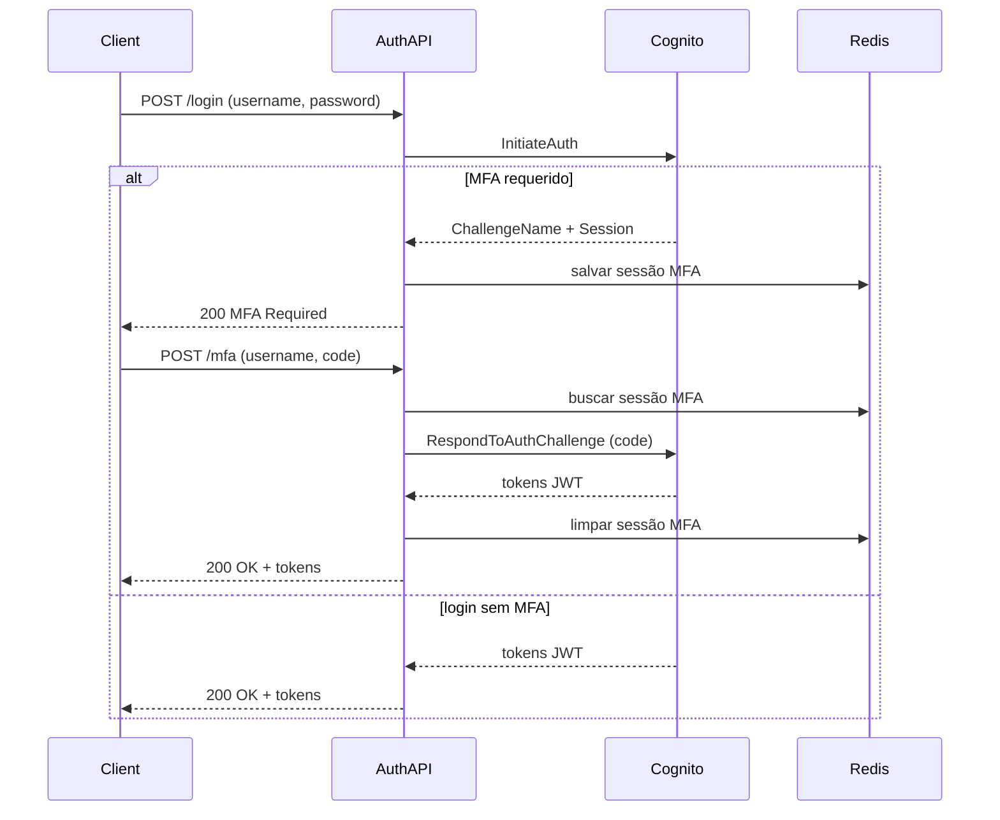

# auth-service - Documentação Técnica Completa

---

## 1. Diagrama de Classes (DDD)

### 1.1 Entidades

* **User**

  * id: UUID
  * username: string
  * email: string
  * passwordHash: string
  * status: enum (ACTIVE, BLOCKED, PENDING_CONFIRMATION)
  * roles: Role[] (admin, user, etc)
  * createdAt: Date
  * updatedAt: Date

* **Session**

  * id: UUID
  * userId: UUID
  * jwtToken: string
  * refreshToken: string
  * expiresAt: Date

* **MfaChallenge** (Value Object)

  * challengeType: enum (SMS, TOTP)
  * challengeCode: string
  * sessionId: UUID
  * expiresAt: Date

### 1.2 Interfaces (Ports)

* **IUserRepository**

  * findByUsername(username: string): Promise\<User | null>
  * create(user: User): Promise<User>
  * update(user: User): Promise<void>

* **ISessionRepository**

  * create(session: Session): Promise<Session>
  * findByToken(token: string): Promise\<Session | null>
  * delete(sessionId: UUID): Promise<void>

* **IMfaService**

  * sendChallenge(user: User, type: ChallengeType): Promise<MfaChallenge>
  * verifyChallenge(challenge: MfaChallenge, code: string): Promise<boolean>

---

## 2. Diagrama de Sequência

### 2.1 Fluxo de Criação de Conta



### 2.2 Fluxo de Login com MFA



---

## 3. Mapa de Eventos Kafka

O **auth-service** pode publicar eventos para os outros microsserviços para sinalizar ações importantes, tais como:

| Evento                  | Tópico Kafka         | Descrição                             | Consumidores                        |
| ----------------------- | -------------------- | ------------------------------------- | ----------------------------------- |
| UserRegistered          | `user-registered`    | Usuário criado com sucesso            | account-service, loan-service       |
| UserLoggedIn            | `user-logged-in`     | Login bem-sucedido                    | audit-service, notification-service |
| UserMfaChallengeStarted | `user-mfa-challenge` | Início do desafio MFA para um usuário | audit-service                       |

### Exemplo do payload JSON:

```json
{
  "userId": "uuid-do-usuario",
  "username": "usuario123",
  "timestamp": "2025-08-07T20:00:00Z",
  "eventType": "UserRegistered"
}
```

---

## 4. Observações importantes

* A autenticação principal utiliza **AWS Cognito** para gerenciar credenciais e MFA.
* A sessão temporária para MFA é armazenada no **Redis** para rápida consulta e expiração automática.
* A comunicação com Kafka deve ser assíncrona e idempotente.
* A responsabilidade do auth-service é **não armazenar senhas**, apenas a delegação para o Cognito.
